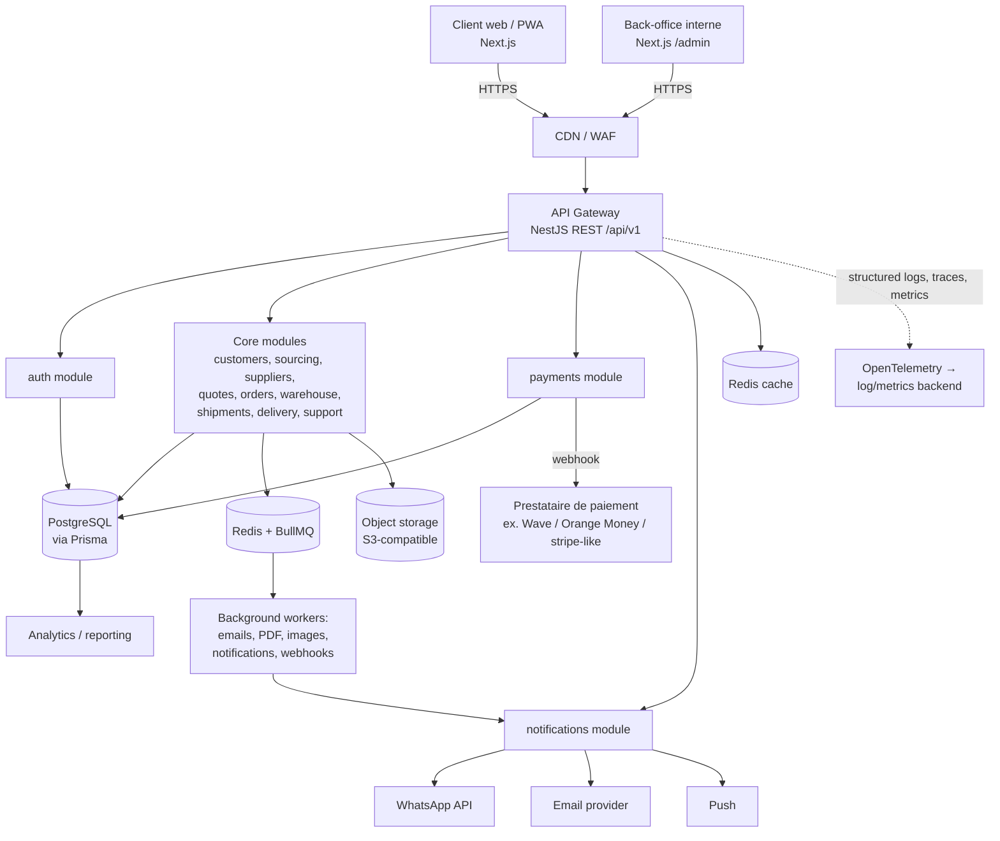
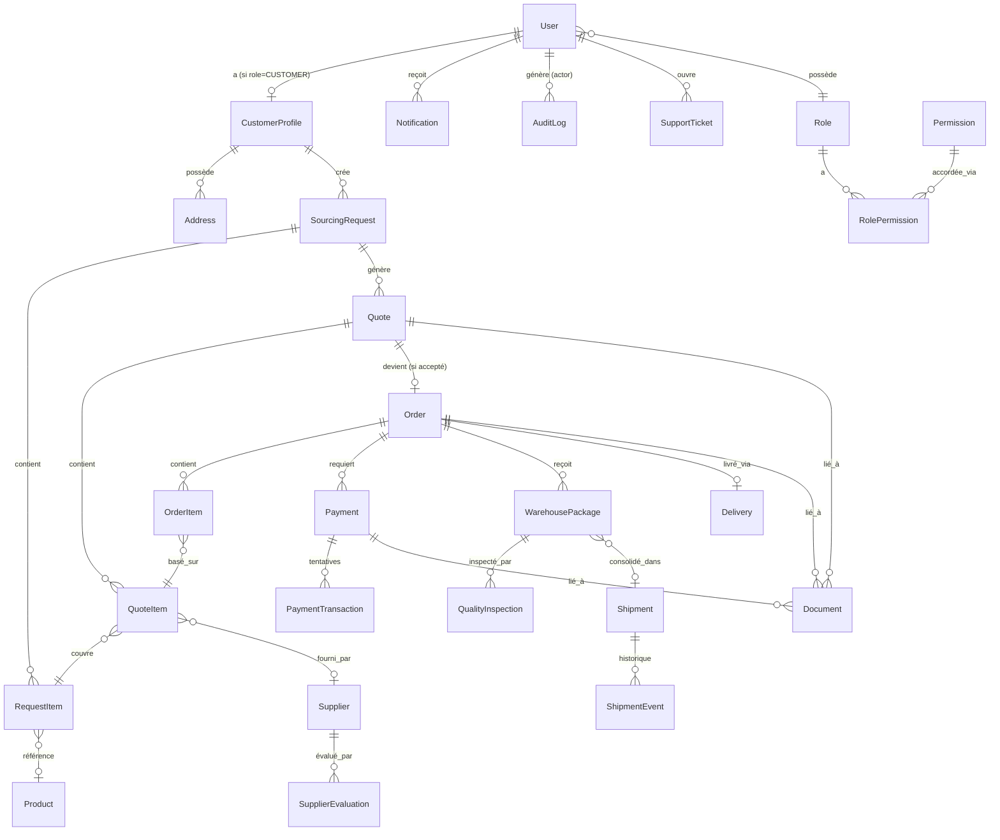
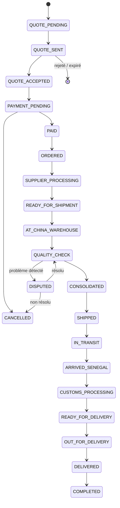
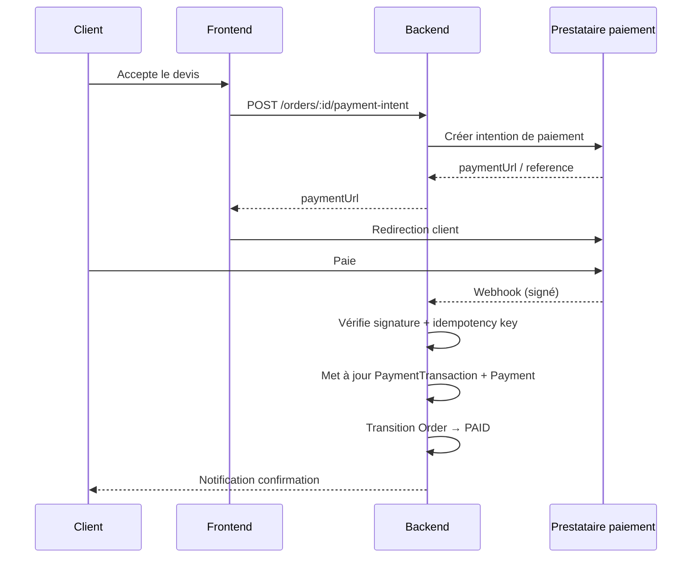

# ARCHITECTURE.md — Plateforme de Sourcing Chine → Sénégal

> Statut : DRAFT — à valider avant le début de l'implémentation (Étape 1).
> Ce document traduit `project.md` (le besoin produit) en décisions techniques concrètes. Toute section marquée **[DÉCISION OUVERTE]** doit être tranchée avant de scaffolder le repo.

---

## 1. Objectif du document

Avant d'écrire du code, fixer :
- l'architecture système et les frontières entre services,
- le modèle de données (ERD) et les entités du MVP,
- les machines à états (commande, paiement),
- le découpage modulaire du backend et les contrats d'API,
- le modèle de sécurité et RBAC,
- l'infra, le CI/CD, l'observabilité,
- le séquençage MVP → V2 → V3.

Ce document sert de référence pour la revue technique avant l'Étape 1 (« Architecture + repository + conventions »).

---

## 2. Vue d'ensemble système



**Principes :**
- Le frontend ne fait **jamais** confiance à lui-même pour un état sensible (paiement, statut de commande) : tout est vérifié côté backend.
- Un seul backend NestJS modulaire au démarrage (pas de microservices) — les modules sont conçus pour être extraits en services séparés plus tard si le besoin réel apparaît (ex. `payments`, `notifications`, `warehouse`).
- Les tâches non-critiques pour la réponse HTTP (email, PDF, sync) passent par une queue, jamais en synchrone dans la requête.

---

## 3. Stack technique — décisions

| Domaine | Choix | Justification |
|---|---|---|
| Frontend web | Next.js 14+ (App Router), TypeScript strict, Tailwind, React Hook Form + Zod, TanStack Query | Recommandé par le brief, écosystème mature, SSR/SEO pour les pages publiques, mobile-first facile avec Tailwind |
| Backend | NestJS + TypeScript, architecture modulaire | Structure imposée par convention (modules/DTO/guards), bon fit pour RBAC strict et Swagger auto-généré |
| Base de données | PostgreSQL + Prisma ORM | Intégrité relationnelle forte nécessaire (argent, statuts de commande), migrations versionnées natives |
| Cache / Queue | Redis + BullMQ | Un seul composant pour cache + queue, réduit la complexité opérationnelle au stade MVP |
| Stockage fichiers | S3-compatible (ex. Cloudflare R2 ou équivalent) avec URLs signées | Documents/photos non publics par défaut (§23 du brief) |
| Auth | JWT access token (courte durée) + refresh token rotatif, hashing Argon2id | Argon2id = standard moderne recommandé (OWASP) au-dessus de bcrypt pour ce cas d'usage |
| Paiements | Intégration prestataire tiers adapté Sénégal (Wave / Orange Money / PawaPay / agrégateur) | Jamais de système bancaire maison (§16) — **[DÉCISION OUVERTE]** choix du prestataire exact |
| Notifications | WhatsApp Business API (canal principal), email (Resend/SES), push (web push / FCM plus tard) | WhatsApp = canal dominant au Sénégal |
| Observabilité | OpenTelemetry + backend agnostique (ex. Grafana Cloud / Better Stack) | Éviter le lock-in fournisseur |
| Hébergement | Séparation dev/staging/production dès le départ | Voir §14 |
| i18n | next-intl ou i18next, FR par défaut + EN | Architecture prête pour Wolof/Arabe plus tard |

---

## 4. Découpage des modules backend (NestJS)

Un module = un dossier `src/modules/<name>` avec `controller`, `service`, `dto`, `entities`(types Prisma), `guards` si spécifique.

```
src/modules/
  auth/            # login, refresh, OTP, password reset, MFA admin
  users/           # comptes internes + rôles
  customers/       # profils client, adresses
  sourcing/        # demandes de sourcing (SourcingRequest)
  suppliers/       # fournisseurs, évaluations, supplier score
  quotes/          # devis + moteur de calcul de prix
  orders/          # commandes, state machine
  payments/        # intégration prestataire, webhooks, réconciliation
  quality-control/ # inspections en entrepôt Chine
  warehouse/       # colis reçus, consolidation
  shipments/       # expéditions, événements de tracking
  delivery/        # livraison finale Sénégal
  notifications/   # orchestration multi-canal
  support/         # tickets support
  documents/       # upload/stockage/URLs signées
  pricing/         # taux de change, règles tarifaires réutilisées par quotes
  analytics/       # agrégats dashboard
  admin/           # endpoints réservés back-office
  audit/           # interceptor global + requêtes de consultation des logs
```

Règle de dépendance : les modules métier (`orders`, `payments`, `warehouse`, …) ne s'appellent jamais directement entre eux par accès DB croisé — ils passent par les services exportés du module concerné. `audit` est un module transverse consommé via un interceptor global (pas d'appel manuel dispersé partout).

---

## 5. Modèle de données (ERD — MVP)



### Entités clés — champs notables

- **User** — `id (uuid)`, `email?`, `phone?`, `passwordHash`, `roleId`, `mfaEnabled`, `status`, `createdAt`, `deletedAt` (soft delete).
- **CustomerProfile** — `userId`, `firstName`, `lastName`, `companyName?`, `preferredLanguage`.
- **SourcingRequest** — `code` (`REQ-2026-000001`), `customerId`, `status` (`RECEIVED`, `IN_ANALYSIS`, `QUOTED`, `CLOSED`), `submittedVia` (`LINK`/`PHOTO`/`DESCRIPTION`), `createdAt`.
- **RequestItem** — `requestId`, `productLink?`, `photoDocumentId?`, `description?`, `quantity`, `color?`, `size?`, `variants (jsonb)`, `budgetAmount?`, `budgetCurrency`, `destination`.
- **Supplier** — `name`, `contact`, `platform` (`ALIBABA`/`1688`/`OTHER`), `moq`, `rating`, `notes`.
- **SupplierEvaluation** — `supplierId`, `evaluatedBy (userId)`, `priceScore`, `qualityScore`, `delayScore`, `reactivityScore`, `issueRate`, `computedScore`, `createdAt`.
- **Quote** — `code` (`QUOTE-2026-000001`), `requestId`, `status` (`DRAFT`,`SENT`,`ACCEPTED`,`REJECTED`,`EXPIRED`), `currency`, `exchangeRateUsed`, `validUntil`, `createdBy`.
- **QuoteItem** — `quoteId`, `requestItemId`, `supplierId?`, `productCost`, `chinaInlandShipping`, `supplierFees`, `qualityControlFee`, `consolidationFee`, `internationalFreight`, `otherCosts`, `serviceFee`, `realCost` *(interne)*, `clientPrice`, `margin` *(interne, jamais exposé au client)*.
- **Order** — `code` (`ORD-2026-000001`), `quoteId`, `customerId`, `status` (voir §7), `totalAmount`, `currency`, `createdAt`.
- **OrderItem** — miroir de `QuoteItem` figé au moment de la commande (immuable, ne doit pas changer si le devis source est modifié après coup).
- **Payment** — `orderId`, `amountDue`, `amountPaid`, `status` (`PENDING`,`PARTIALLY_PAID`,`PAID`,`REFUNDED`,`FAILED`), `provider`.
- **PaymentTransaction** — `paymentId`, `providerTransactionId` (unique, clé d'idempotence), `amount`, `status`, `rawWebhookPayload (jsonb)`, `receivedAt`.
- **WarehousePackage** — `code` (`PKG-2026-000321`), `orderId`, `status`, `receivedAt`, `photos[]`.
- **QualityInspection** — `packageId`, `inspectedBy`, `quantityVerified`, `variantVerified`, `issueReported (bool)`, `notes`, `mediaDocumentIds[]`.
- **Shipment** — `code`, `status`, `departedAt?`, `arrivedAt?`.
- **ShipmentEvent** — `shipmentId`, `type`, `description`, `occurredAt` (alimente la timeline client §19).
- **Delivery** — `orderId`, `addressId`, `status`, `deliveredAt?`.
- **Document** — `ownerType` (`ORDER`/`QUOTE`/`PAYMENT`/`INSPECTION`/`REQUEST_ITEM`), `ownerId`, `storageKey`, `mimeType`, `visibility` (`INTERNAL`/`CUSTOMER`), `signedUrlExpiresAt`.
- **Notification** — `userId`, `channel`, `eventType`, `payload`, `status`, `sentAt`.
- **SupportTicket** / **SupportMessage** *(ajout implicite nécessaire, non listé explicitement mais requis pour "contacter le support")* — `ticketId`, `orderId?`, `messages[]`, `status`.
- **AuditLog** — `actorId`, `action`, `entityType`, `entityId`, `before (jsonb)`, `after (jsonb)`, `ip`, `userAgent`, `createdAt` — table append-only, pas d'UPDATE/DELETE autorisé applicativement.
- **Role** / **Permission** / **RolePermission** — table de jointure pour un vrai RBAC (voir §8).

Principes transverses : `id` en UUID, `createdAt`/`updatedAt` partout, soft delete (`deletedAt`) sur les entités avec valeur métier/légale (User, Order, Payment, Document), montants stockés en entier (centimes ou plus petite unité) jamais en float.

**[DÉCISION OUVERTE]** `Document.ownerType/ownerId` est un polymorphisme applicatif (pas de FK native) — accepté au MVP pour la flexibilité, à documenter comme dette technique assumée dans `DATABASE.md`.

---

## 6. API — structure (`/api/v1`)

REST + OpenAPI/Swagger généré depuis les DTO NestJS. Versionnée dès le départ.

```
POST   /api/v1/auth/register
POST   /api/v1/auth/login
POST   /api/v1/auth/refresh
POST   /api/v1/auth/otp/verify
POST   /api/v1/auth/password/forgot
POST   /api/v1/auth/password/reset

GET    /api/v1/customers/me
PATCH  /api/v1/customers/me
POST   /api/v1/customers/me/addresses

POST   /api/v1/sourcing-requests
GET    /api/v1/sourcing-requests/mine
GET    /api/v1/sourcing-requests/:id

GET    /api/v1/admin/sourcing-requests          (SOURCING_AGENT+)
POST   /api/v1/admin/suppliers
POST   /api/v1/admin/quotes
PATCH  /api/v1/admin/quotes/:id

POST   /api/v1/quotes/:id/accept
POST   /api/v1/quotes/:id/reject

POST   /api/v1/orders/:id/payment-intent
POST   /api/v1/payments/webhook/:provider   (public, signature vérifiée)

GET    /api/v1/orders/mine
GET    /api/v1/orders/:id/tracking

POST   /api/v1/admin/warehouse/packages
POST   /api/v1/admin/warehouse/packages/:id/inspection
POST   /api/v1/admin/shipments
POST   /api/v1/admin/shipments/:id/events

GET    /api/v1/documents/:id/signed-url

GET    /api/v1/notifications/mine
PATCH  /api/v1/notifications/preferences

POST   /api/v1/support/tickets
GET    /api/v1/support/tickets/mine

GET    /api/v1/admin/analytics/overview
GET    /api/v1/admin/audit-logs
```

Toute route `/admin/*` exige un guard de rôle + est journalisée si l'action est sensible (voir §8, §13).

---

## 7. Machine à états — Commande



Implémentation : une table de transitions autorisées (`Map<Status, Status[]>`) validée côté service `orders`, jamais laissée au client de choisir le prochain statut. Chaque transition passe par `audit` si déclenchée par un admin.

---

## 8. Authentification, autorisation, RBAC

- **Auth client** : email ou téléphone + mot de passe (Argon2id), OTP par SMS/WhatsApp pour vérification et pour actions sensibles (changement de mot de passe, changement de téléphone).
- **Auth interne (staff/admin)** : email + mot de passe + **MFA obligatoire** (TOTP), session plus courte, re-auth requise sur actions critiques (remboursement, changement de rôle).
- **Tokens** : JWT access (15 min) + refresh token rotatif stocké hashé en DB (permet révocation immédiate).
- **RBAC** : `Role` → `RolePermission` → `Permission` (table de jointure, pas de rôles hardcodés dans le code métier). Rôles initiaux repris du brief : `CUSTOMER`, `SUPPORT_AGENT`, `SOURCING_AGENT`, `LOGISTICS_AGENT`, `QUALITY_CONTROL`, `FINANCE`, `MANAGER`, `ADMIN`, `SUPER_ADMIN`.
- Guard NestJS générique `@RequirePermission('orders:read:all')` plutôt que `@RequireRole('ADMIN')` en dur, pour respecter le principe de moindre privilège et permettre d'ajuster les permissions sans redéployer la logique métier.
- Un `CUSTOMER` n'accède qu'à ses propres ressources (vérifié par `ownerId` dans le service, pas seulement par le guard — protection anti-IDOR).

---

## 9. Paiements



Règles non négociables (reprises du brief §16) :
- Le statut `PAID` n'est **jamais** posé par le frontend — uniquement par le traitement du webhook backend, après vérification de signature.
- Idempotency key = `providerTransactionId` unique en DB (contrainte unique) pour éviter le double traitement d'un webhook rejoué.
- Réconciliation : job planifié qui compare `PaymentTransaction` vs relevé du prestataire (à définir en V1.1 selon l'API du prestataire retenu).

**[DÉCISION OUVERTE]** Choix du prestataire de paiement sénégalais (Wave Business API / Orange Money / agrégateur type PawaPay ou CinetPay) — dépend des accords commerciaux, à trancher avant l'Étape 9.

---

## 10. Sourcing, devis, moteur de tarification

Le module `pricing` expose un service pur (fonction déterministe, testable unitairement) :

```
computeQuoteItem({
  productCost, chinaInlandShipping, supplierFees,
  qualityControlFee, consolidationFee, internationalFreight,
  otherCosts, serviceFeeRule, exchangeRate
}) => { realCost, clientPrice, margin }
```

- `serviceFeeRule` : configurable (pourcentage, forfait, ou barème par tranche) — stocké en config, pas en dur dans le code, pour permettre l'ajustement commercial sans déploiement.
- Le détail affiché au client (§14 du brief) reprend uniquement les lignes non-confidentielles ; `margin` et `realCost` ne sont jamais sérialisés dans une réponse API accessible à un rôle `CUSTOMER`.
- Le `Supplier Score` (§12) est un calcul dérivé (moyenne pondérée des `SupplierEvaluation`), recalculé en job async après chaque nouvelle évaluation, pas en query lourde à chaque lecture.

---

## 11. Logistique (warehouse → QC → consolidation → shipment → delivery)

Suit le flux du brief §17-19 : `WarehousePackage` reçu → photos/quantité vérifiées → `QualityInspection` → rattaché à un `Shipment` (consolidation N colis → 1 shipment) → `ShipmentEvent` alimente la timeline client → `Delivery` au Sénégal.

La timeline client (§19) est une **projection en lecture seule** calculée à partir de `Order.status` + `ShipmentEvent`, pas une table dupliquée à maintenir manuellement.

---

## 12. Notifications

Service centralisé `notifications` consommé par tous les autres modules via un event emitter interne (`OrderStatusChanged`, `QuoteSent`, `PaymentConfirmed`, …) plutôt que des appels directs dispersés — permet d'ajouter un canal (SMS) sans toucher aux modules métier. Envoi réel délégué aux workers BullMQ (jamais synchrone dans la requête HTTP). Préférences par utilisateur (`NotificationPreference`) respectées avant envoi.

---

## 13. Sécurité — résumé du threat model

| Risque | Mitigation |
|---|---|
| Paiement falsifié côté client | Statut posé uniquement via webhook vérifié (§9) |
| IDOR (accès commande d'un autre client) | Vérification `ownerId` systématique dans les services, pas seulement guard de rôle |
| Escalade de privilège | RBAC granulaire + MFA admin + audit log sur changement de permission |
| Fuite de documents (photos, factures) | Object storage privé + URLs signées à expiration courte |
| Brute force login/OTP | Rate limiting (par IP + par compte), verrouillage progressif |
| Injection SQL | Prisma (requêtes paramétrées) exclusivement, pas de SQL brut sans binding |
| XSS | Sanitization des champs libres (description, notes), CSP stricte côté Next.js |
| Rejeu de webhook paiement | Idempotency key unique en DB + vérification de signature |
| Secrets en clair | Secret manager (ex. Doppler/Vault/GCP Secret Manager selon hébergeur retenu), jamais en `.env` commité |
| Accès interne non tracé | Interceptor `audit` global sur les routes `/admin/*` sensibles |

Document dédié `SECURITY.md` à produire séparément avec détail des tests de sécurité (§30 du brief : IDOR, brute force, injection, escalade).

---

## 14. Infrastructure & environnements

- Trois environnements isolés : `development`, `staging`, `production` — bases de données séparées, jamais de données clients réelles hors production.
- **[DÉCISION OUVERTE — liée à la mémoire projet]** Hébergement cible actuel : Render (le billing GCP est bloqué faute de carte valide — cf. contexte Yombal). À confirmer si ce choix s'applique aussi à ce projet ou si un autre hébergeur est prévu pour la plateforme de sourcing.
- Pas de Kubernetes au démarrage (conforme §27 du brief) — PaaS (Render/Railway/Fly.io) suffisant pour le volume MVP, réévaluer à l'échelle V2/V3.
- Backups automatisés PostgreSQL (quotidien + rétention définie dans `DEPLOYMENT.md`).

---

## 15. Observabilité

- Logging structuré (JSON) avec `requestId` de bout en bout.
- OpenTelemetry pour traces + métriques, export vers un backend agnostique.
- Health checks (`/health`, `/health/db`, `/health/redis`) pour le monitoring d'uptime.
- Alertes sur : échec de paiement répété, webhook non traité après N minutes, taux d'erreur 5xx anormal.

---

## 16. CI/CD

```
Push → Lint → Type Check → Unit Tests → Integration Tests → Build
     → Security Scan (dépendances) → Deploy Staging → E2E → Approbation manuelle → Production
```

Aucune modification directe en production ; toute release passe par staging + E2E avant promotion (conforme §31 du brief).

---

## 17. Stratégie de tests

- **Unit** : moteur de tarification (`pricing`), transitions de statut (`orders`), calcul du supplier score.
- **Integration** : DB (Prisma + testcontainers ou DB de test dédiée), auth, workflow commande complet.
- **E2E** : parcours client complet (Request → Quote → Payment → Order → Tracking → Delivery), via Playwright — cohérent avec la suite E2E déjà en place sur le projet Yombal, réutilisable comme référence de patterns.
- **Sécurité** : accès non autorisé, IDOR, brute force, injection — checklist dédiée avant chaque release majeure.

---

## 18. Séquençage MVP → V2 → V3

Reprend fidèlement §40-42 du brief — aucun changement de scope, juste la traduction en jalons techniques :

**MVP (V1)** : auth + RBAC, profil client, sourcing request, quotes + pricing engine, orders + state machine, intégration paiement (1 seul prestataire), tracking basique, notifications (WhatsApp + email), warehouse/QC basique, documents, admin dashboard minimal, audit log.

**V2** : warehouse management avancé, QC avancé, consolidation optimisée, analytics avancées, wallet/crédits client (sous réserve légale), app mobile (React Native + Expo), supplier scoring automatisé.

**V3** : sourcing assisté par IA, recherche par image, supplier intelligence, devis automatisés, pricing engine avancé, marketplace/catalogue, comptes business/B2B, API partenaires.

---

## 19. Estimation de coûts infra (ordre de grandeur, MVP)

**[DÉCISION OUVERTE — à affiner selon l'hébergeur retenu §14]**

| Poste | Estimation mensuelle |
|---|---|
| Hébergement app (frontend + backend, PaaS) | 20–60 $ |
| PostgreSQL managé | 15–50 $ |
| Redis managé | 10–25 $ |
| Object storage (S3-compatible) | 5–15 $ |
| WhatsApp Business API | variable selon volume (souvent le poste le plus coûteux à l'échelle) |
| Email transactionnel | 0–20 $ (paliers gratuits usuels) |
| Observabilité (plan gratuit/starter) | 0–30 $ |
| **Total indicatif MVP** | **~50–200 $/mois** hors WhatsApp à volume |

À affiner une fois le prestataire de paiement et l'hébergeur définitivement choisis.

---

## 20. Décisions tranchées (mises à jour 2026-09-04)

Ces décisions ne dépendent pas d'un contrat business à signer et bloqueraient inutilement l'Étape 1 si on attendait — elles sont prises maintenant, avec une architecture qui garde chaque choix swappable :

1. **Paiement** : intégration derrière une interface `PaymentProvider` (méthodes `createIntent`, `verifyWebhook`, `parseWebhookEvent`) dans le module `payments` — aucun code métier ne dépend directement d'un SDK de prestataire. Implémentation MVP ciblée : **CinetPay** (agrégateur couvrant Wave, Orange Money, Free Money en un seul contrat/API, évite d'intégrer chaque wallet séparément). *Suppose à confirmer côté business avant signature de contrat — mais le code n'en dépend pas structurellement.*
2. **Hébergement** : **Render** pour web + API (cohérent avec la décision déjà prise sur Yombal — cf. mémoire projet — et suffisant pour le volume MVP sans gérer d'infra). Postgres managé (Render Postgres ou Neon), Redis via Upstash (serverless-friendly), stockage objet via Cloudflare R2 (S3-compatible, pas d'egress fees).
3. **WhatsApp** : API Cloud officielle Meta en direct (pas d'agrégateur/BSP) pour éviter le markup par message — géré par une classe `WhatsAppChannel` derrière l'interface `NotificationChannel` du module `notifications`, donc remplaçable par 360dialog/Twilio plus tard sans toucher au reste du module.
4. **`Document`** : polymorphisme applicatif (`ownerType`/`ownerId`) conservé comme dette technique assumée — le volume de documents au MVP ne justifie pas la complexité de tables dédiées par entité.
5. **Repo** : **mono-repo** avec npm workspaces + Turborepo (`apps/web`, `apps/api`, `packages/shared`) — types/DTO/schémas Zod partagés entre frontend et backend sans publier de package séparé.

---

*Étape 1 en cours : scaffolding du repo (structure, conventions, tooling, CI squelette) conformément à §44 de `project.md`.*
